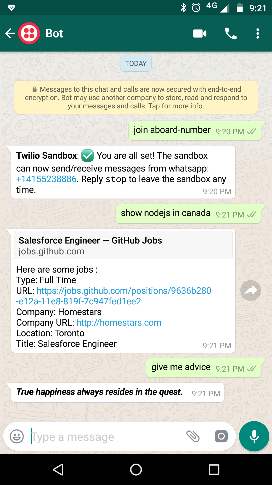
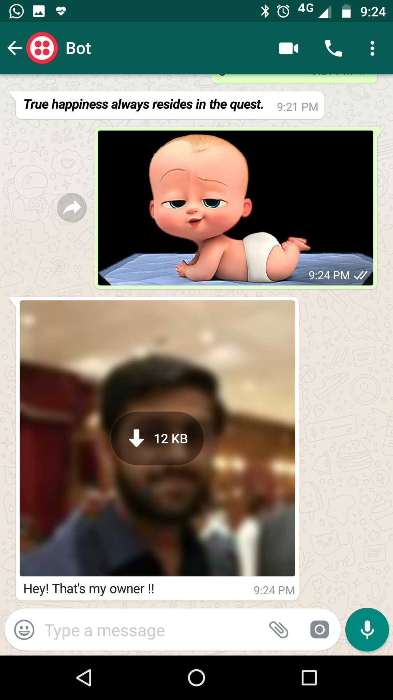

# Kartik's Bot for WhatsApp

## Made by - Twilio, Dialogflow, Python, Flask

## How to use - 

#### 1. Save a contact in your contact list with number +14155238886
#### 2. Open whatsapp chat with this number and send a message "join aboard-number".
#### 3. Now, you can simply talk with my Bot and ask him about developer jobs in various countries. For example - send a message "show python jobs in london", "show nodejs in canada", "show java jobs", etc.
#### 4. Note - Only gives information of available jobs in foreign countries, not in India.
#### 5. You can also ask for any random advice by just sending a message like "give me advice" , "give advice",  etc.
#### 6. When you send a picture to him, it will also reply with a picture.

### Screenshots 

    

